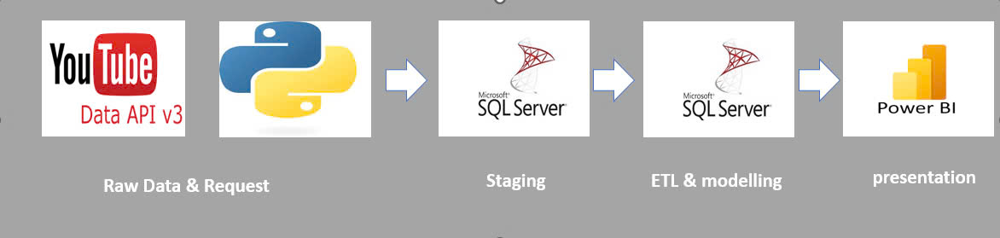
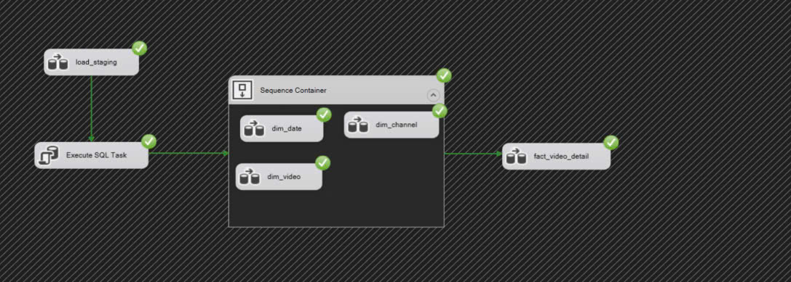
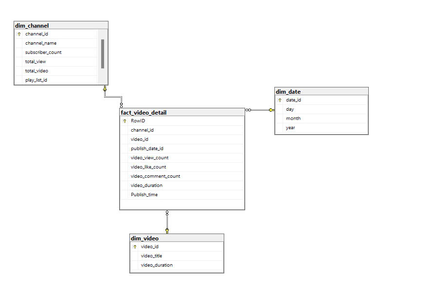

# YouTube Data Extraction and Analysis Pipeline

## Project Overview

This project focuses on extracting YouTube data through the YouTube Data API, processing the data in SQL Server, and visualizing the insights using Power BI. The entire pipeline is designed to enable analysis of key metrics such as video views, likes, comments, and subscriber counts over time.

### Pipeline Overview:

1. **Raw Data**: Extract data using YouTube Data API v3.
2. **Data Request**: A Python script requests data from the YouTube API and pushes it to SQL Server.
3. **Staging**: The extracted data is loaded into a staging area in SQL Server for further processing.
4. **ETL Process**: The Extract, Transform, Load (ETL) process organizes and cleans the data, storing it in fact and dimension tables in SQL Server.
5. **Presentation**: Power BI is used to create dashboards for visualizing YouTube metrics such as views, likes, comments, and subscribers.

---

## Data Flow Diagram

### Extraction and Loading

The data is requested from YouTube API using a Python script. After extraction, the raw data is staged in a SQL Server database for processing.

### ETL Process in SQL Server

Data transformation is handled by SQL Server, where various dimensions and fact tables are populated with cleaned data. Key tables include:

- `dim_channel`: Stores channel-level information (e.g., channel ID, subscriber count).
- `dim_video`: Stores video-specific details such as video ID and duration.
- `dim_date`: Contains date information for temporal analysis.
- `fact_video_detail`: Combines video, channel, and date information to store detailed metrics such as view count, like count, and comment count.

### Data Model

The star schema design allows for efficient querying and reporting. It consists of three dimension tables (`dim_channel`, `dim_video`, `dim_date`) and one fact table (`fact_video_detail`), which stores the metrics for each video over time.

---

## Power BI Dashboard

The data is visualized in Power BI, where metrics such as total views, likes, comments, and subscriber counts are presented. Some of the key visualizations include:

- **Total Comments, Likes, and Subscribers**: Overview of key metrics.
- **View Count by Video Duration**: Displays how video duration impacts view count.
- **Likes & Comments by Duration**: Analyzes the relationship between video duration and user engagement.

### Prerequisites

- Python 3.x for data extraction from the YouTube API
- Microsoft SQL Server for staging and ETL processing
- Power BI for data visualization
- YouTube Data API v3 access (API key required)

---

### Usage

1. Run the Python script to extract data from the YouTube API and load it into SQL Server.
2. Use SQL Server to process and transform the data into fact and dimension tables.
3. Load the data into Power BI and refresh the dashboard to see the latest metrics.

---

### License

This project is licensed under the MIT License.
